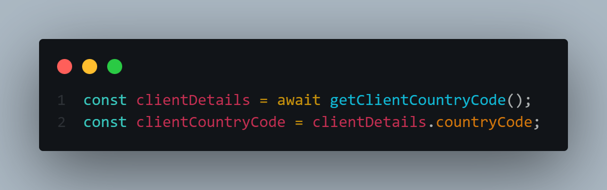

# **Client redirects for Shopify**

## **Getting started**
Start by creating a file in your snippets directory and name it something appropriate. This file is going to house our Javascript code, so the filename should end in .js.liquid

### Example
snippets/client-redirects.js.liquid

---

## **Creating the redirect function**
Now that we have created our file, we can begin building our redirect function. Start by creating an asynchronous function. This will be an **Immediately Invoked Function Expression (IIFE)**, which means that the function will run as soon as it is defined.

All of our future code will go inside of this function.

### Example IIFE

---

## **Creating our store objects**
We can now start building out our stores. This will be an array of objects, each object will contain the stores hostname, and the countries we want that store to service.

### Example

---

## **Getting the clients country code**
Our Array of stores has been created, now we need to identify what country our client is visiting our site from.

For this we are going to create an asynchronous function, In my example I will call it **getClientCountryCode**. This will make a **GET** request to the IP-API. This is an API that will return a JSON object which will include the clients **countryCode**.

#### **IMPORTANT**
The IP-API does include a free option, however, the user is limited to 45 requests per minute. So if you are expecting more than 45 customers per minute during a peak season, you may want to explore a paid option. I'll include a link to their website below.

**[IP-API Website](https://https://ip-api.com/)**

Lets create our **getClientCountryCode** function.

### Example
**Order of operations**
- Start by awaiting the return value of our API request and storing it in a variable, for example response.
- We then need to parse the returned JSON object. We will store this in a variable called result.
- Finally we need to check that the request we made was successful. If it was we can return the result, otherwise we need to create a fallback object with our default countryCode.

Now that we have created our function to get the clients countryCode, we need to call it, and store the return value in a variable.

In the example above, I am destructuring our returned object to access the countryCode. I'll provide an example where I don't destructure the object and you can implement whichever option is more comfortable.

---

## **Matching corresponding country code**
We now have access to the clients countryCode, we can now find the applicable store based on the clientCountryCode.

### Example

**Please note:** This array method is on 1 line which means that the return is implicit.

---

## **Comparing the clients current URL to the clientStoreUrl**
Now that we know the correct store for the client, we should check to see if the store they are currently on is already the correct one.

### Example
Start by getting the current store URL and storing it in a variable. We only need to know the hostname here.

Next we can check if the currentUrl includes our clientStoreUrl. If it does it means that the client is on the correct store, and we can return out of the function.

---

## **Constructing our redirect URL**
If the currentUrl does not include the clientStoreUrl, that is an indication that our client is on the wrong store and it's time to redirect them.

Firstly we need to check if there is a pathname, or a search query in the URL. It's important to take this step, because if we need to redirect the client, we want to redirect them to their desired page, not just the home page.

### Example
#### Storing the pathname
In the example we are using a **Ternary Operator**(shorthand for an if/else statement) to check if the pathname is '/', if it is we just want to store an empty string, else we want to store the pathname.

#### Storing the search query

---

## **Redirecting the client**
Finally we can concatenate our clientStoreUrl, path & search to redirect the client.

---

## **Storing redirect information in sessionStorage**
Our redirect function currently works, however, it is going to run on every page. Let's add a piece of state to our sessionStorage that we can reference at the start of our function. This piece of state will be an indication as to whether or not we have already determined if the client is on the correct store.

Lets start by first setting our sessionStorage state. A good place to set this information will be straight after we have identified the clientStoreUrl.

To set our state in the sessionStorage, we need to provide a name that we can reference, and a value. In our case we will call it dontRedirect and set the value to true.

### Example

Now that we are setting our state in sessionStorage, we can now check if it has been set at the start of our function. If dontRedirect is true, we know that we have already confirmed that the user is on the correct store, and we can return out of our function.

